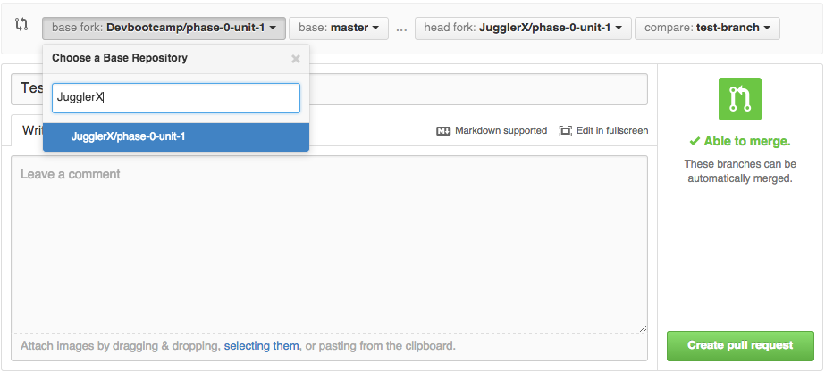
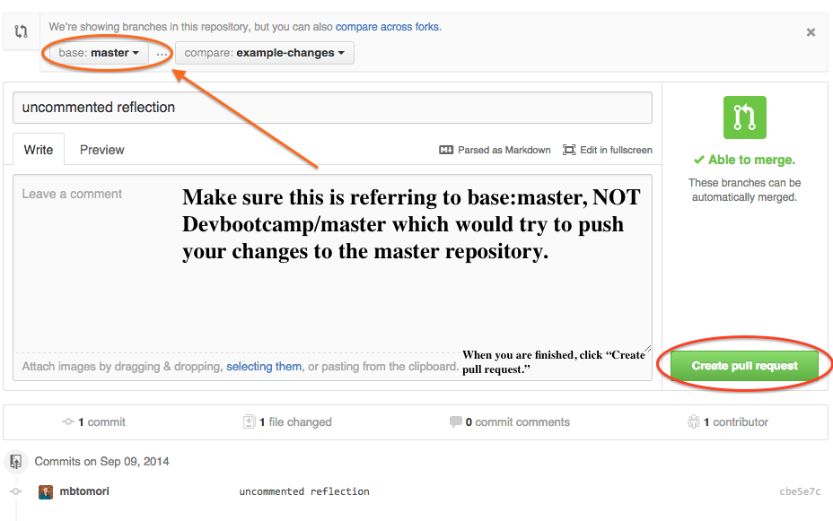
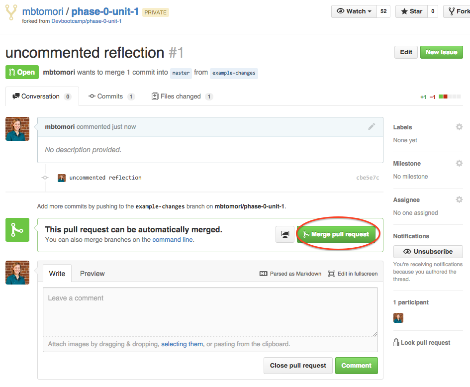

# Making Pull Requests

In the [tracking changes challenge](README.md), you just pushed up your changes to a remote branch using the following command:

You can then push this branch to GitHub.

```shell
$ git push origin new-branch-name
```

Now it's time to create a pull request. First, watch the following video:

[](https://www.youtube.com/watch?v=4nUG-wrH0iA)


We have also included text instructions below. They work in most cases, when working with your phase 0 unit curriculum forks there is an extra step to find your repo to initiate the pull request process so you don't end up making pull requests to Dev Bootcamp's master repository automatically.

Because you just pushed your changes to GitHub, go look at your fork. You should be see that branch in the drop-down menu. Click on it.

Right below the branch drop-down will be a grey bar that has pull request and compare on the right.


Click on "pull request." This will show you a summary of the files that were changed. At the top, it will show you which branch you are making the pull request on.

**Note** This is where you'll need to "hack" GitHub to make it work properly and should work in most cases (this deviates from the normal Pull Request workflow). If you can not find your repo you need to change the URL in the URL bar from *github.com/**devbootcamp**/phase-0-unit-1/compare/master...USERNAME:BRANCHNAME?expand=1* to *github.com/**USERNAME**/phase-0-unit-1/compare/master...USERNAME:BRANCHNAME?expand=1*

Because there are so many forks of the Phase 0 curriculum, it's unlikely yours shows up in the list. 

Now that you've hacked GitHub, check that it's working properly. 

The "base fork" should point to YOUR-USERNAME/phase-0-unit-1 with base: master.

On the right your first dropdown should be your own fork USERNAME/phase-0-unit-1 where "compare" points to the branch you pushed, not the master.



Once you have the correct branches, you may want to put a comment in on what you changed, or just press "Create pull Request."



This is normally where you would stop as a contributor to a project, since it's not good practice to merge your own changes either. But since you are the only collaborator, you'll need to go through the extra two steps.

***

# Merging changes

Since you know you want to merge those changes, you'll need to click on the pull request you just made, and click "Merge pull request." If it's not on your screen, click on the pull-request icon in the vertical navigation bar to the right of your screen.



It will ask you to confirm the merge, so make sure you do that. Then you'll want to clean up your branches and delete that extra branch you made by pressing the "Delete branch" button.


# Making improvements to DBC's curriculum!

So this process is really empowering to you as well. If you notice a typo in Devbootcamp's curriculum, or any other problems, you can actually make improvements yourself using this process and create a pull request to have them merged. Just make sure you are careful about which changes you make a pull request for. Any changes that add personal content will be rejected.

The only thing you will want to make sure you do is keep Devbootcamp:master as the branch you want to compare to make the pull request. Be sure to add good comments about the changes you made. It will make it easier for us to approve them.
