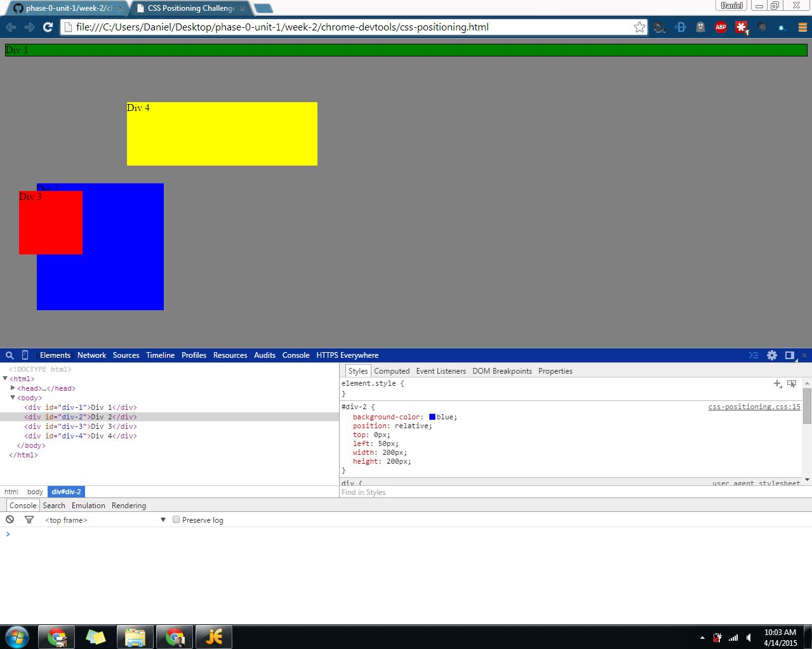
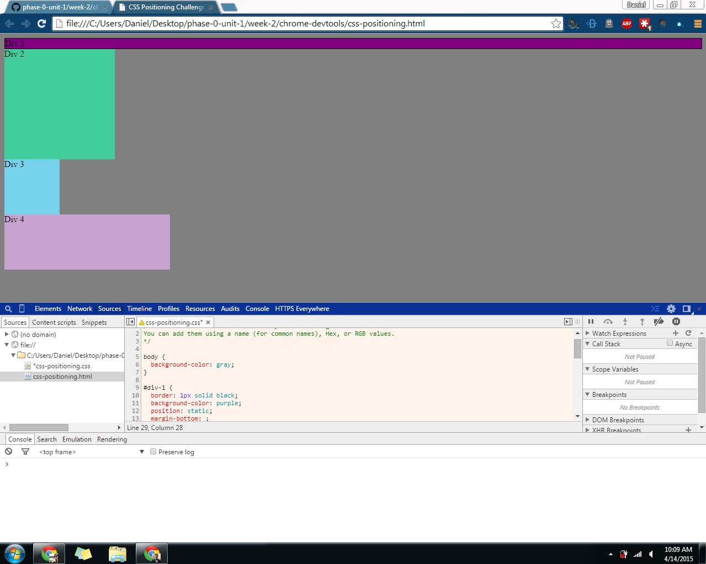
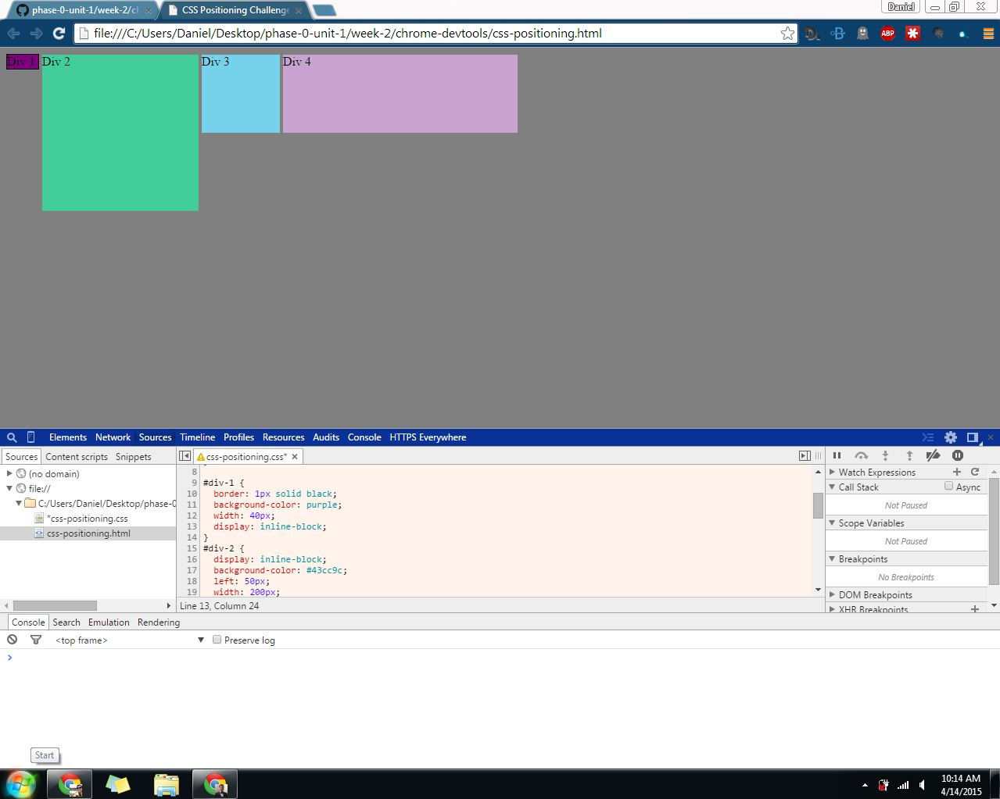
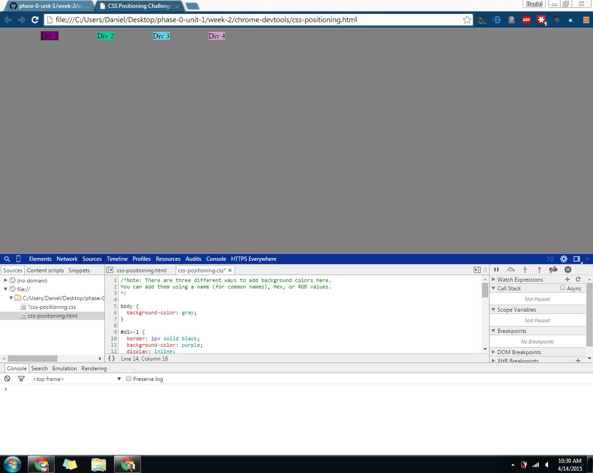
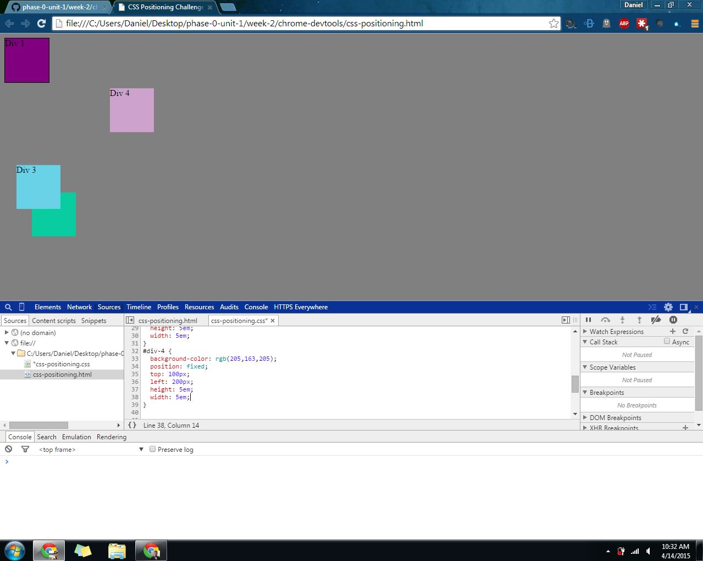
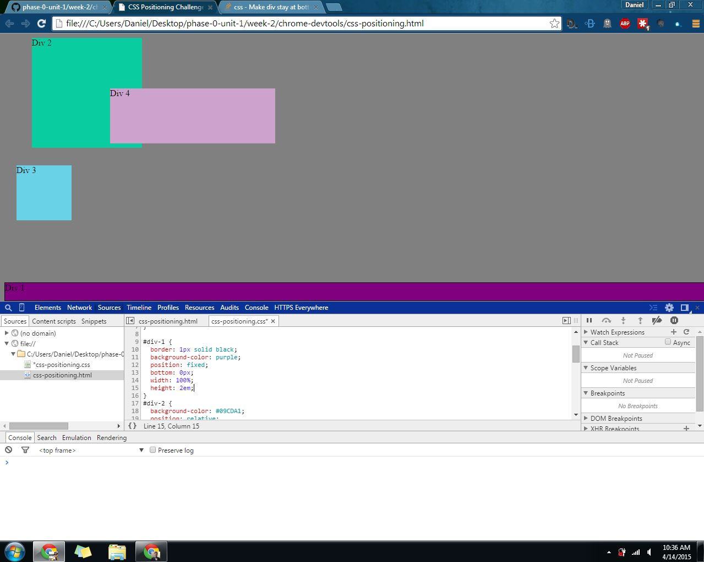
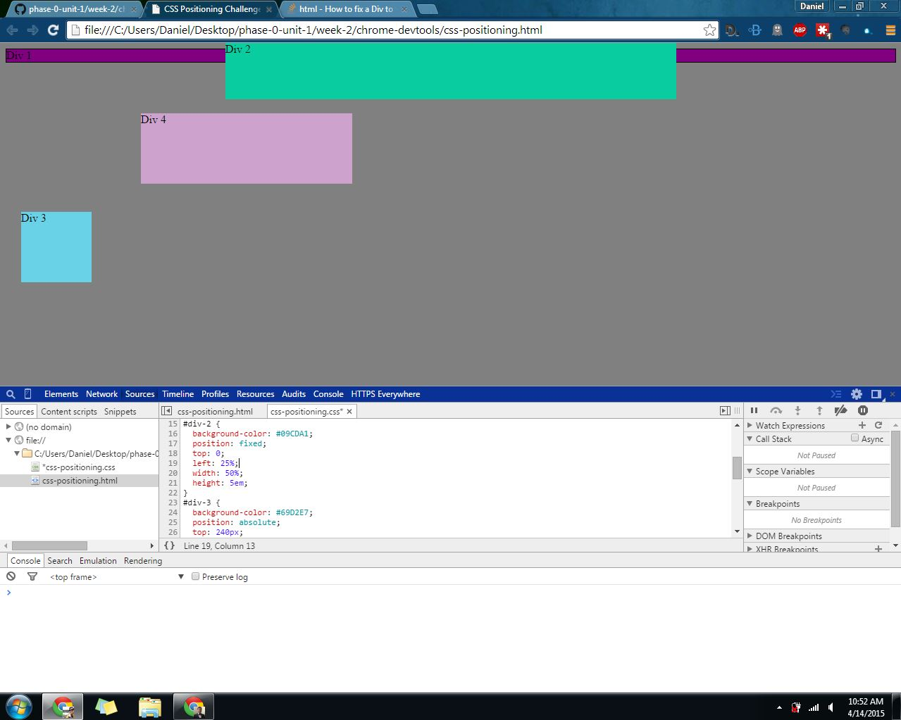
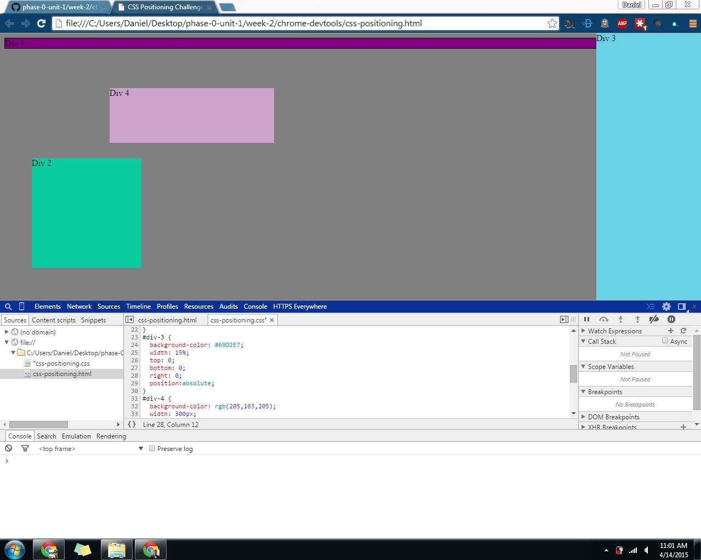
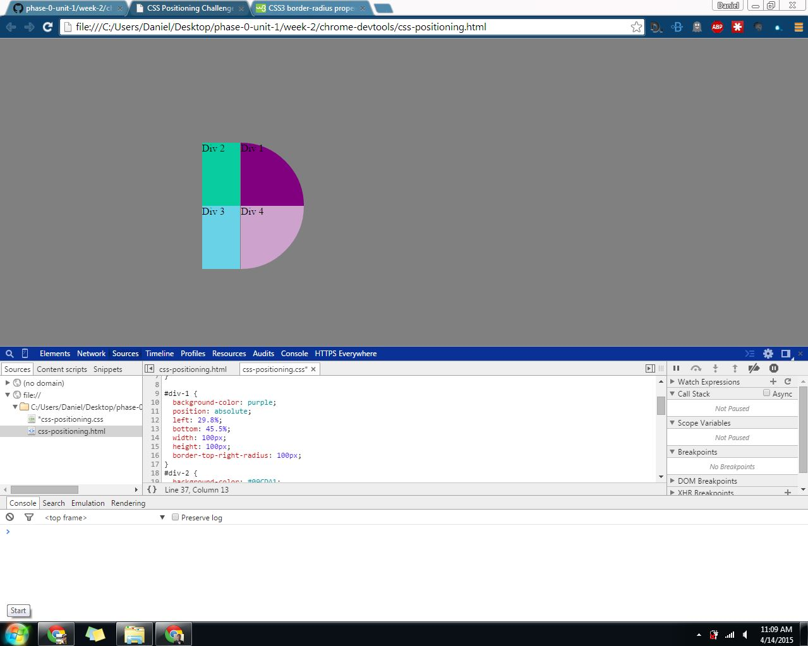

# 7. Chrome Dev Tools Challenge Reflection

#### I spent 3 hours on this challenge.

## Release 2: Positioning

#### 1. Change the Colors
<!-- Add the screenshot here -->

#### 2. Column
<!-- Add the screenshot here -->

#### 3. Row
<!-- Add the screenshot here -->

#### 4. Make Equidistant
<!-- Add the screenshot here -->

#### 5. Squares
<!-- Add the screenshot here -->

#### 6. Footer
<!-- Add the screenshot here -->

#### 7. Header
<!-- Add the screenshot here -->

#### 8. Sidebar
<!-- Add the screenshot here -->

#### 9. Get Creative
<!-- Add the screenshot here -->

## Release 3: Reflection
Use the [reflection guidelines](https://github.com/Devbootcamp/phase-0-handbook/blob/master/coding-references/reflection-guidelines.md) to help frame your reflection.
<!-- Remember, reflections should only take about 10-15 minutes to write -->

	This was a really good challenge. It was beyond my existing ability but not beyond my ability to figure out. A lot of the satisfaction that you get from coding is from doing things like these because it's tough but not discouraging and when you finish, it's really satisfying. 

	I'm feeling quite satisfied right now. :D 

	In my experience, 70% of coding is knowing what to google and that definitely showed up here. Happily the documentation is all there, you just have to know how to apply it in the different context than whatever guide you've found is written in. That's what I need to work on: developing an intuition to see how each element relates to each other and which ones will conflict (i.e. is you use position: absolute, what will you use to make the element appear in such and such a place versus if you use position: relative). This will come in time as I continue to try to gain an understanding of margin, padding, and all the rest. 